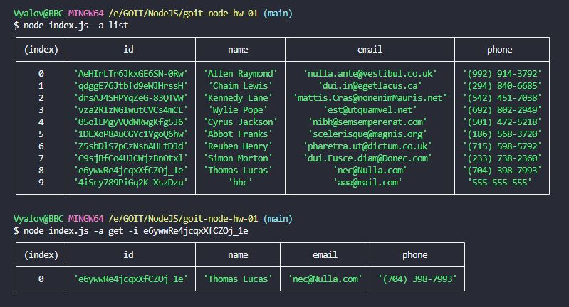
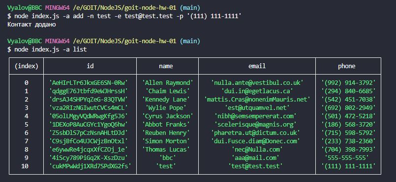
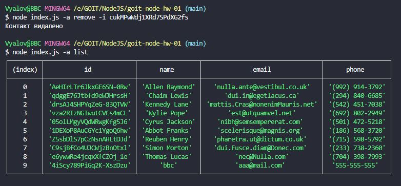

#Home work number one Node JS

## виконання команди "node index.js -a list" "node index.js -a get -i e6ywwRe4jcqxXfCZOj_1e"

## виконання команди "node index.js -a add -n test -e test@test.test -p '(111) 111-1111'" "node index.js -a list"

## виконання команди "node index.js -a remove -i cukMPwWdj1XRd7SPdXG2fs" "node index.js -a list"

